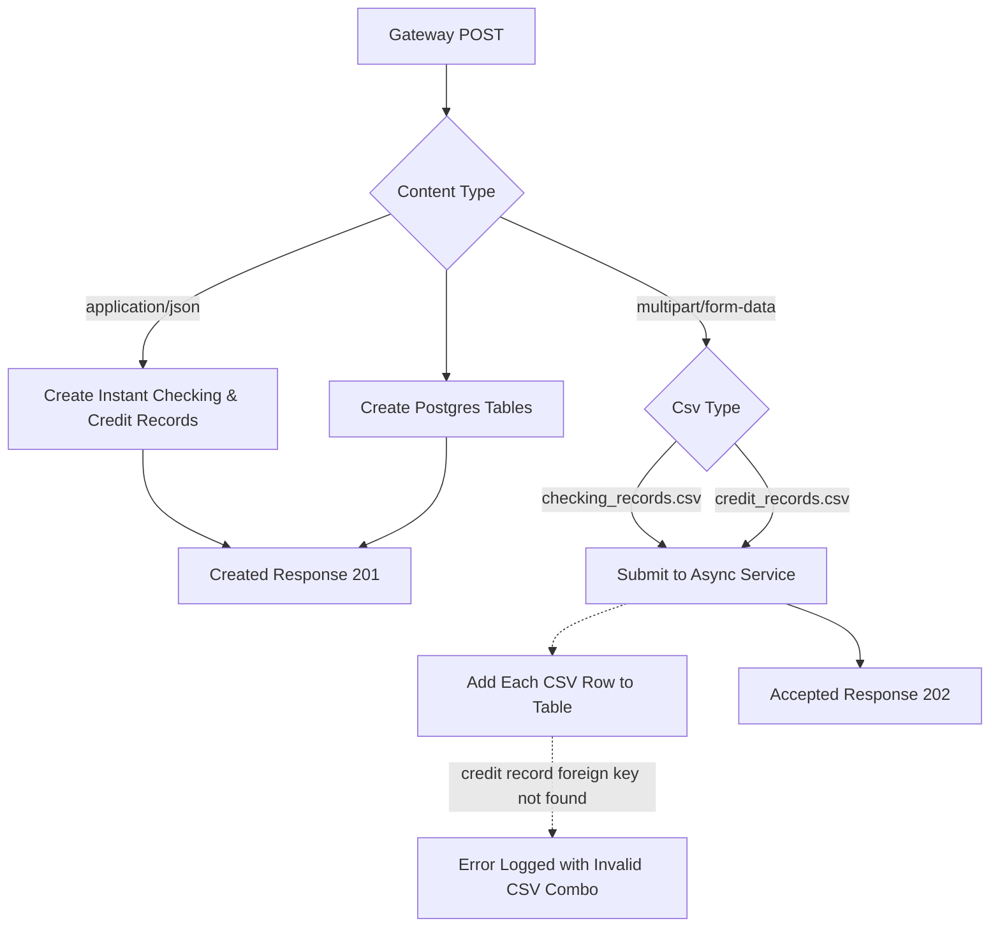

```mermaid
flowchart TD
gateway[Gateway POST] --> type{Content Type}

    %% JSON Content Type Path
    type --> |application/json| json[Create Instant Checking & Credit Records]
    json --> createdres[Created Response 201]
    
    %% Multipart Content Type Path
    type --> |multipart/form-data| form{Csv Type}
    form --> |checking_records.csv| async[Submit to Async Service]
    async -.-> checkingasync[Add Each CSV Row to Table]
    async --> acceptedres[Accepted Response 202]
    
    form --> |credit_records.csv| async[Submit to Async Service]
    
    %% Error Handling
    checkingasync -.-> |credit record foreign key not found| asyncerror[Error Logged with Invalid CSV Combo]
    
    %% Unspecified Content Type Path
    type --> unspecified[Create Postgres Tables]
    unspecified --> createdres[Created Response 201]
```